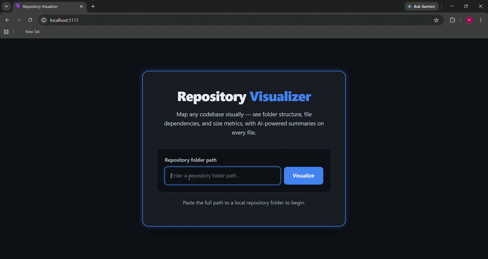
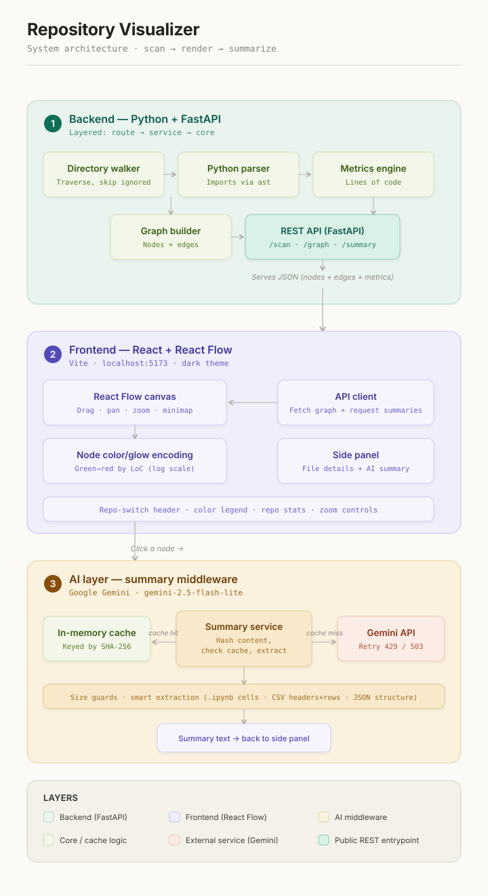
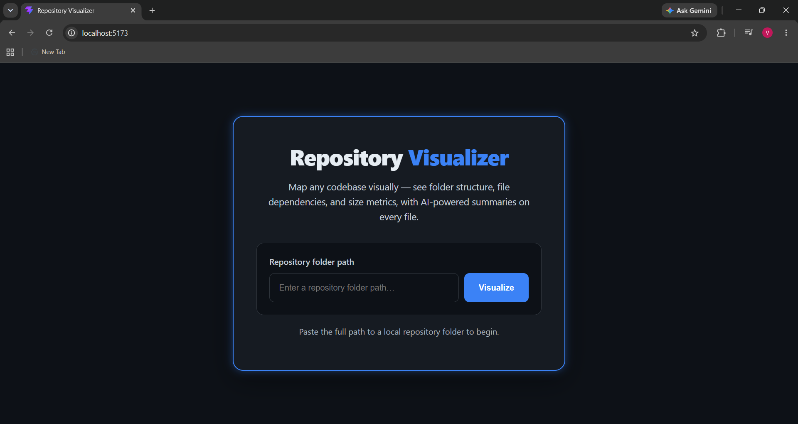
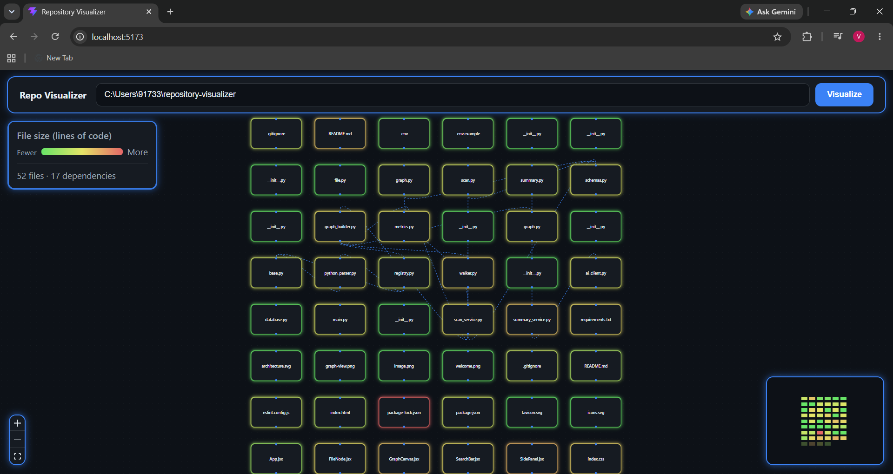
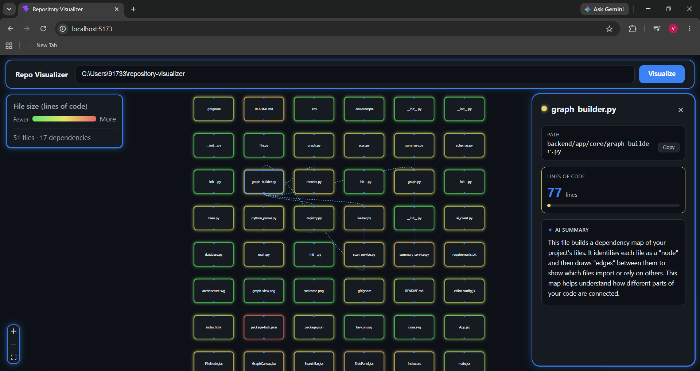

# Repository Visualizer

> Analyze any local Git repository into an interactive dependency graph with AI-powered file explanations, file metrics, and visual architecture mapping. Repository Visualizer helps developers quickly understand unfamiliar codebases by displaying file relationships, highlighting large files, and generating plain-English summaries for individual files.

## Demo



## Overview

Jumping into an unfamiliar codebase is hard: file explorers show you folders, but not how files actually connect or which ones carry the most weight. Repository Visualizer scans a local repository, parses its Python imports to map dependencies, measures each file's size, and renders everything on an interactive React Flow canvas. Nodes are color-coded by lines of code (green → red on a log scale), so bloated files stand out at a glance. Click any node and a side panel opens with file details and a short AI-written summary of what the code does — turning hours of code-reading into seconds of orientation.

## Features

- **Interactive dependency graph** — files rendered as draggable nodes on an infinite React Flow canvas; pan, zoom, and a minimap for navigating large repos.
- **Size-based color encoding** — each node is colored and glow-styled from green to red by lines of code (log scale), making large files instantly visible.
- **AI file summaries** — click any node to get a short, plain-English explanation of what that file does, generated by Google Gemini.
- **Content-hash caching** — summaries are cached by a SHA-256 hash of file content, so a file is only re-summarized when it actually changes (saves API calls and time).
- **Resilient AI calls** — automatic retries on rate-limit (429) and busy-model (503) errors, with a clear message to the user instead of a crash.
- **Smart content extraction** — for large or structured files, only the meaningful parts are sent to the AI: code cells from notebooks (`.ipynb`), column headers and sample rows from CSVs, and structure from JSON.
- **Size guards** — oversized files are handled safely so a giant notebook or data file never overwhelms the AI request.
- **Repo stats and legend** — a color legend and repository statistics panel give immediate context for what you're looking at.

## Performance

- Fast repository scanning through lightweight static analysis.
- AI summaries are cached using SHA-256 content hashes, so unchanged files are summarized only once.
- Smart content extraction reduces token usage for notebooks, CSVs, and JSON files.
- Repository scanning and graph generation happen locally, keeping source code private.

## Tech Stack

**Backend**
- Python + FastAPI (REST API at `http://127.0.0.1:8000`)
- Python `ast` module for import detection
- Layered architecture: route → service → core (walker, metrics, parsers, graph builder)

**Frontend**
- React + Vite (`http://localhost:5173`)
- React Flow (`reactflow@11`) for the interactive canvas
- Dark theme with blue-glow styling, color legend, repo stats, minimap, and zoom controls

**AI**
- Google Gemini (`gemini-2.5-flash-lite`) via the `google-genai` SDK

## Supported Languages

### Currently Supported

- Python
  - Dependency analysis using Python's built-in `ast` module.

### Planned Support

- JavaScript (ES Modules / CommonJS)
- C/C++ (`#include` dependency analysis)

## Architecture

The backend is organized in layers so each responsibility lives in one place: an API **route** receives a request, hands it to a **service** that coordinates the work, which calls **core** modules — the directory walker, the metrics calculator, the import parser, and the graph builder. Responses are returned as typed schemas (nodes, edges, files, and graph/scan responses), so the data the frontend receives is well-defined and predictable. The frontend fetches the assembled graph (nodes + edges + metrics) as JSON and renders it; clicking a node triggers a separate summary request that flows through the AI layer.



The AI layer sits behind the `/summary` endpoint. When a summary is requested, the service hashes the file content and checks an in-memory cache: on a hit it returns the cached summary instantly; on a miss it extracts the relevant content, calls Gemini (with retry handling), caches the result, and returns it.

## Prerequisites

Before setting up, make sure you have:

- **Python 3.10+** — [python.org/downloads](https://www.python.org/downloads/)
- **Node.js 18+** (includes npm) — [nodejs.org](https://nodejs.org/)
- **Git** — [git-scm.com](https://git-scm.com/)
- **A Google Gemini API key** — free from [Google AI Studio](https://aistudio.google.com/app/apikey)

## Setup & Installation

The app runs **locally**, not deployed — by design, because it reads files directly from your own disk. You'll run the backend and frontend as two separate servers.

### 1. Clone the repository

```bash
git clone https://github.com/Pujitha449821/repository-visualizer.git
cd repository-visualizer
```

### 2. Backend setup

From the project root, move into the backend folder and create a virtual environment:

```powershell
cd backend
python -m venv venv
.\venv\Scripts\Activate.ps1
```

> On Windows PowerShell, if activation is blocked by an execution-policy error, run
> `Set-ExecutionPolicy -Scope Process -ExecutionPolicy Bypass` once for this terminal, then activate again.

Install dependencies:

```powershell
pip install -r requirements.txt
```

Create your environment file. Copy the provided template and add your own key:

```powershell
copy .env.example .env
```

Then open `.env` and set your key:
GEMINI_API_KEY=your_api_key_here

> `.env` is git-ignored, so your key is never committed. `.env.example` shows the expected format.

### 3. Frontend setup

Open a **second terminal**, then from the project root:

```powershell
cd frontend
npm install
```

## Running the App

You need **both servers running at the same time**, each in its own terminal.

**Terminal 1 — backend** (from `backend/`, with the venv activated):

```powershell
uvicorn app.main:app --reload
```

The API will be available at `http://127.0.0.1:8000`.

**Terminal 2 — frontend** (from `frontend/`):

```powershell
npm run dev
```

The app will be available at `http://localhost:5173`. Open that URL in your browser.

## Usage

1. On the welcome screen, paste the **full path to a local repository folder** (for example, `C:\Users\you\some-project`).
   - On Windows, paste the path **without surrounding quotes**.
2. Click **Visualize**. The repo is scanned and rendered as a graph.
3. **Drag** nodes to rearrange, **scroll** to zoom, and use the minimap to navigate.
4. **Click any node** to open the side panel with file details and an AI summary.
5. Use the header to switch to a different repository at any time.





### AI Summary Panel



## API Endpoints

FastAPI auto-generates interactive documentation — once the backend is running, visit **`http://127.0.0.1:8000/docs`** to explore and test all endpoints live in your browser.

| Method | Endpoint | Description |
|--------|----------|-------------|
| `GET` | `/scan` | Scans a given local folder path and indexes its files. |
| `GET` | `/graph` | Returns the graph as JSON: nodes (files + metrics) and edges (dependencies). |
| `GET` | `/summary` | Returns an AI-generated summary for a given file (cached by content hash). |

## Project Structure

```
repository-visualizer/
├── backend/
│   ├── app/
│   │   ├── main.py                 # FastAPI app entry point
│   │   ├── api/
│   │   │   ├── schemas.py          # Typed request/response models
│   │   │   └── routes/             # /scan, /graph, /summary, (file.py scaffold)
│   │   ├── core/
│   │   │   ├── walker.py           # Directory traversal
│   │   │   ├── metrics.py          # Lines-of-code metrics
│   │   │   ├── graph_builder.py    # Assembles nodes + edges
│   │   │   ├── models/graph.py     # Graph data model
│   │   │   └── parsers/            # base.py, registry.py, python_parser.py
│   │   ├── services/
│   │   │   ├── scan_service.py     # Scan orchestration
│   │   │   └── summary_service.py  # AI summary + content-hash cache
│   │   └── infra/
│   │       └── ai_client.py        # Google Gemini client
│   ├── requirements.txt
│   └── .env.example                # Template for your GEMINI_API_KEY
│
├── frontend/
│   ├── src/
│   │   ├── components/
│   │   │   ├── GraphCanvas/        # GraphCanvas.jsx, FileNode.jsx
│   │   │   ├── SidePanel/          # SidePanel.jsx
│   │   │   └── SearchBar/          # SearchBar.jsx
│   │   ├── pages/Dashboard.jsx
│   │   ├── services/api.js         # Backend API calls
│   │   ├── App.jsx
│   │   ├── main.jsx
│   │   └── index.css
│   ├── public/                     # favicon.svg, icons.svg
│   ├── package.json
│   └── vite.config.js
│
├── docs/
│   ├── architecture.svg
│   └── screenshots/                # graph-view.png, welcome.png
│
├── README.md
└── .gitignore

```
## Design Decisions

- **Runs locally, not deployed.** The tool reads files from the user's own machine, so it's intentionally a local app rather than a hosted service — this keeps your code private and avoids uploading any source.
- **In-memory caching.** Summaries are cached in memory keyed by content hash, which is simple and fast. The trade-off is that the cache clears when the backend restarts.
- **`gemini-2.5-flash-lite`.** Chosen for its generous free-tier quota, which suits an interactive tool that may summarize many files.
- **Python-only parsing for now.** The tool reads Python `import` statements (using Python's built-in `ast` module) to map dependencies. The parser is built with a plug-in structure, so support for other languages like JavaScript or C++ can be added later without major changes.

## Limitations

- Dependency analysis currently supports Python source files only.
- AI summaries require a valid Google Gemini API key and an internet connection.
- Summary caching is stored in memory and is cleared when the backend restarts.
- Very large repositories may take longer to scan depending on the number and size of files.

## Future Improvements

- Persistent SQLite cache so AI summaries survive backend restarts.
- Extend dependency analysis to JavaScript and C/C++ using the existing parser architecture.
- Add advanced code metrics such as cyclomatic complexity and maintainability index.
- Improve automatic graph layouts for very large repositories.
- Add search and filtering capabilities for navigating large dependency graphs.

## Acknowledgements

Built for **GDSC Open Projects Summer '26 (IITR)**. UI inspiration from developer tools like dependency-cruiser and the graph views in modern IDEs.